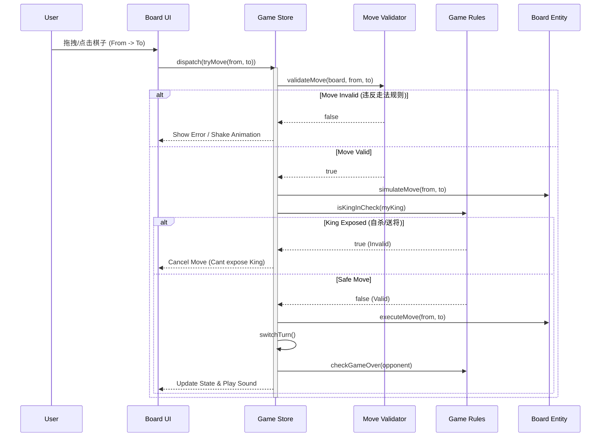

# 中国象棋项目架构设计文档

本文档详细描述了中国象棋项目的架构设计，该设计遵循整洁架构（Clean Architecture）和 SOLID 原则，旨在构建一个可维护、可测试且高内聚低耦合的前端应用。

## 1. 架构概览

系统采用同心圆分层架构，依赖关系严格遵循**由外向内**的原则。核心业务逻辑不依赖任何外部框架或 UI 库。

### 层级划分

1.  **Domain Layer (核心领域层)**
    *   **职责**: 包含最核心的业务实体和规则。
    *   **特点**: 纯 TypeScript 代码，无任何外部依赖（不依赖 React, Zustand 等）。
    *   **内容**: 棋子定义、棋盘状态、走法规则验证。

2.  **Application Layer (应用层)**
    *   **职责**: 编排业务流程，处理应用状态。
    *   **特点**: 依赖 Domain 层，定义用例（Use Cases）。
    *   **内容**: 游戏状态管理 (Store)、游戏流程控制（开始、移动、悔棋、胜负判定）。

3.  **Presentation Layer (表现层)**
    *   **职责**: 负责 UI 渲染和用户交互。
    *   **特点**: 依赖 Application 层。
    *   **内容**: React 组件、Hooks、页面布局。

4.  **Infrastructure Layer (基础设施层)**
    *   **职责**: 提供外部服务和具体实现。
    *   **特点**: 实现 Application 层定义的接口。
    *   **内容**: 本地存储 (LocalStorage)、音效系统、AI 引擎适配器。

---

## 2. 详细设计

### 2.1 Domain Layer (领域层)

#### Entities (实体)
*   **Piece (棋子)**: 定义棋子的属性（类型、颜色、当前位置）。
*   **Board (棋盘)**: 维护 9x10 的网格状态，提供基础的棋子查询方法。
*   **Position (坐标)**: 值对象，表示棋盘上的位置 (x, y)。

#### Logic & Rules (逻辑与规则)
*   **MoveValidator (走法验证器)**: 策略模式。定义 `IMoveValidator` 接口，每种棋子（车、马、炮等）实现自己的验证逻辑。
*   **GameRules (全局规则)**: 处理将军、困毙、长将判负等全局性规则。

### 2.2 Application Layer (应用层)

#### State Management (状态管理)
使用 **Zustand** 管理全局游戏状态：
*   `board`: 当前棋盘快照。
*   `turn`: 当前行动方 (Red/Black)。
*   `history`: 历史记录（用于悔棋）。
*   `status`: 游戏状态（进行中、红胜、黑胜、和棋）。
*   `selectedPosition`: 当前选中的棋子位置。

#### Use Cases (核心用例)
*   **SelectPiece**: 处理用户点击棋子。判断是否属于当前回合、是否可以选中。
*   **MakeMove**: 处理用户尝试移动棋子。
    1.  调用 Domain 层的 Validator 验证走法是否合规。
    2.  模拟移动，检查是否导致己方“被将军”（自杀规则）。
    3.  执行移动，更新棋盘。
    4.  检查是否结束游戏。
    5.  切换回合。

### 2.3 Presentation Layer (表现层)

*   **Tech Stack**: React 19, TypeScript, TailwindCSS, Shadcn UI.
*   **Interaction**: 使用 `react-dnd` 实现棋子的拖拽移动。
*   **Components**:
    *   `ChessBoard`: 棋盘容器，处理背景渲染。
    *   `BoardGrid`: 绘制楚河汉界和网格线。
    *   `ChessPiece`: 棋子组件，封装 Drag Source。
    *   `DropCell`: 棋盘格子，封装 Drop Target。

---

## 3. 架构图示

### 3.1 系统架构图

```mermaid
graph TD
    subgraph "Infrastructure (基础设施)"
        Storage[LocalStorage]
        Audio[Audio System]
    end

    subgraph "Presentation (表现层)"
        UI_Components[React Components]
        UI_Hooks[Custom Hooks]
        DnD[React DnD]
    end

    subgraph "Application (应用层)"
        Store[Game Store (Zustand)]
        UseCases[Use Cases]
    end

    subgraph "Domain (核心领域层)"
        Entities[Entities (Piece, Board)]
        Rules[Rules (Validators)]
        Interfaces[Interfaces]
    end

    UI_Components --> Store
    UI_Components --> DnD
    Store --> UseCases
    UseCases --> Entities
    UseCases --> Rules
    UseCases --> Interfaces
    Store --> Storage
    Store --> Audio

    %% 依赖规则：外层依赖内层
    style Domain fill:#f9f,stroke:#333,stroke-width:2px
    style Application fill:#bbf,stroke:#333,stroke-width:2px
```

### 3.2 核心流程图：走棋逻辑



---

## 4. 目录结构

建议的工程目录结构如下：

```
src/
├── domain/                  # [核心] 业务逻辑 (无框架依赖)
│   ├── constants/           # 常量 (BOARD_WIDTH, PIECE_TYPES)
│   ├── entities/            # 实体定义 (Board.ts, Piece.ts, Position.ts)
│   ├── rules/               # 走法验证器 (HorseRules.ts, CannonRules.ts)
│   └── interfaces/          # 接口定义 (IMoveValidator.ts, IAudioService.ts)
├── application/             # [应用] 状态与流程
│   ├── store/               # Zustand Store (useGameStore.ts)
│   ├── use-cases/           # 复杂业务流程封装 (gameLogic.ts)
│   └── dtos/                # 数据传输对象
├── presentation/            # [表现] UI 组件
│   ├── components/          # React 组件
│   │   ├── board/           # 棋盘相关组件
│   │   ├── pieces/          # 棋子相关组件
│   │   └── ui/              # 通用 UI 组件 (Button, Dialog 等)
│   ├── hooks/               # UI 逻辑 Hooks
│   ├── pages/               # 页面级组件
│   └── layouts/             # 布局组件
├── infrastructure/          # [基础] 外部实现
│   ├── audio/               # 音效管理器实现
│   └── storage/             # 存档管理器实现
└── shared/                  # 共享工具库
    └── utils/
```

---

## 5. SOLID 原则应用说明

### S - 单一职责原则 (SRP)
*   **UI 分离**: `BoardRenderer` 组件只负责将数据渲染成 DOM，不处理任何游戏规则逻辑。
*   **逻辑分离**: `MoveValidator` 类只负责验证“这个棋子能不能这样走”，不负责“移动棋子”或“判断胜负”。

### O - 开闭原则 (OCP)
*   **可扩展的规则**: 通过策略模式实现棋子走法。如果未来需要增加一种新棋子（例如“魔幻象棋”中的新单位），只需新建一个类实现 `IMoveValidator` 接口，无需修改现有的验证逻辑。

### L - 里氏替换原则 (LSP)
*   **统一的棋子行为**: 所有的具体棋子类（`Horse`, `Cannon`）都继承自 `Piece` 基类。在棋盘逻辑中，我们可以统一处理 `Piece[]` 数组，而不需要根据具体类型写大量的 `if-else`。

### I - 接口隔离原则 (ISP)
*   **精简接口**: UI 组件可能只需要读取棋盘状态，因此我们可以定义一个 `IReadableBoard` 接口给 UI 使用，而将修改状态的方法（`movePiece`）保留在 `IMutableBoard` 接口中，仅供 Application 层使用。

### D - 依赖倒置原则 (DIP)
*   **面向接口编程**: `GameStore` 不直接依赖 `LocalStorage` 或 `HTML5Audio`。它依赖于 `IStorageService` 和 `IAudioService` 接口。这使得我们可以轻松地编写单元测试（使用 Mock Storage），或者在将来迁移到其他存储后端（如 IndexDB 或云端同步）。
